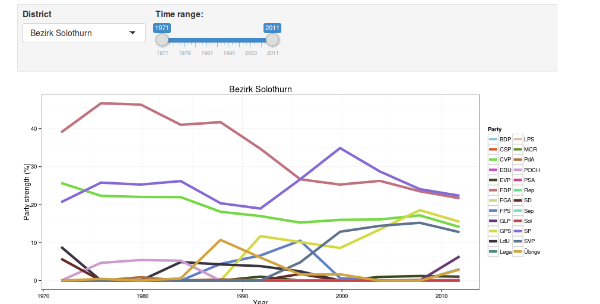

###  Coursera Developing Data Products Course Project

## An interactive, exploratory analysis of election results

Timo Grossenbacher

[@grssnbchr](http://twitter.com/grssnbchr)

Presentation available under [grssnbchr.github.io/cddp](grssnbchr.github.io/cddp)

---

### About me

Data journalist for [SRF Data](http://srf.ch)

---

### Swiss Federal Elections 2015

.fragment Goal: We need a way to find out which parties are strongest in which regions (districts).

.fragment Shiny is the way to go! 

---

### Prototype:

The final application will have `r 11 * 141` district-year combinations: `r 11` years, `r 141` districts.

---

### One last hint:

### Automate EVERYTHING!

<small>Source: giphy.com</small>

<h3>...and make it reproducible.</h3>
